# Lab - Workshop ODA e LLM

Criando um Oracle Digital Assistant para pedidos de Pizza com inteligencia artificial que responde mensagens através da integração com o LLM Maritaca AI.

## Description

Neste laboratório vamos criar: 
- Um Oracle Digital Assistant para interface de conversação e chamadas LLM

- Criar uma chave de API para acesso ao LLM Maritaca AI

## Vamos nessa!

### 1. Provisionar nosso ambiente do Oracle Digital Assistant

* Abra sua console do OCI
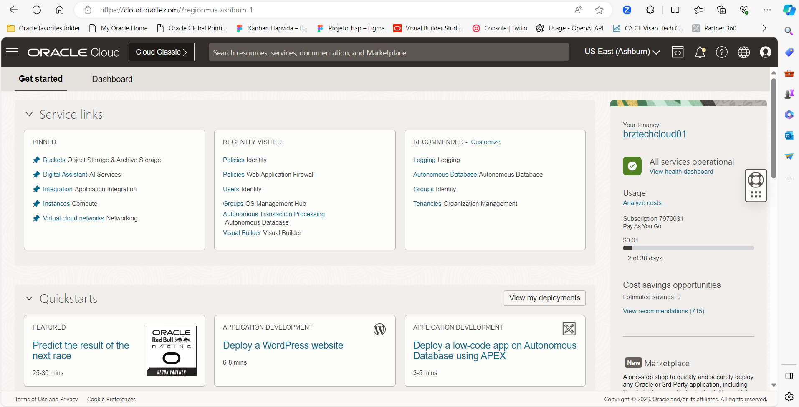

* No menu lateral esquerdo, utilize a barra de pesquisa e selecione a opcão de Digital Assistant
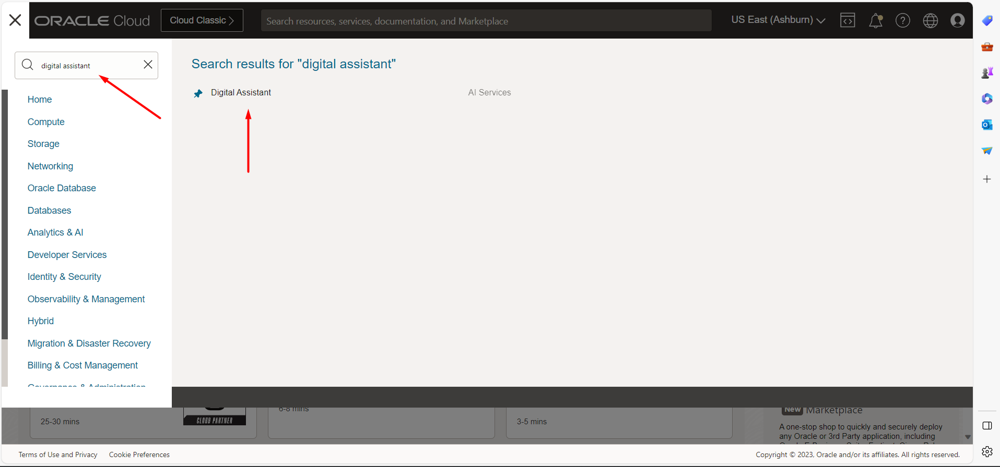

* Selecione o compartment de sua escolha e siga os passos abaixo para criar um novo ambiente

* Passe um Nome, uma Descrição e em SHAPE selecione Development (desenvolvimento), clique em CREATE

* Após provisionado, abra o ambiente e clique em "Service Console" para acessar seu ODA

### 2. Configurar API Services para as integrações com LLM

* Está é a tela inicial da console do Oracle Digital Assistant"
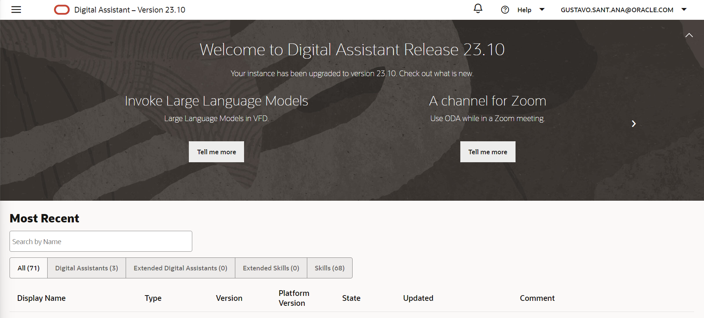

* Clique no menu lateral, SETTINGS e API SERVICES

* Clique no botão Add REST Service para criar uma nova conexão
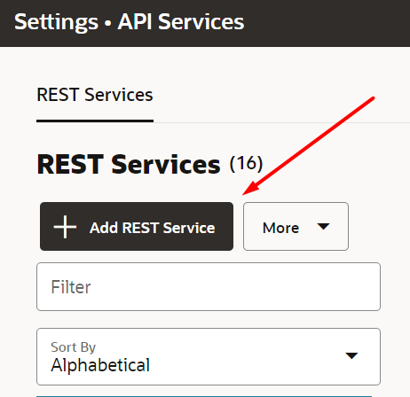

* Em Create REST Service adicione um nome, passe o Endpoint do Maritaca AI e em Method, selecione POST

* Desça até HEADERS e em KEY escreva "authorization" e em VALUE passe key e sua chave API como mostra na imagem:
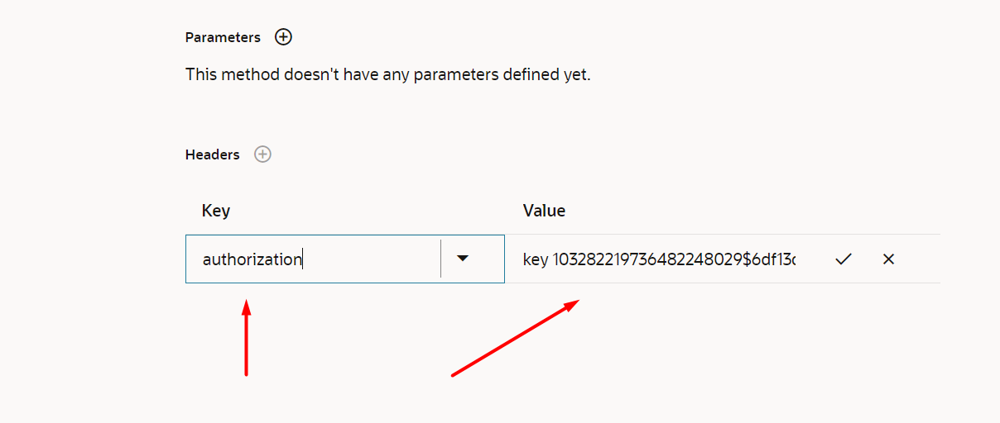

* Em Request, Content Type selecione application/json e em Body, adicione o texto abaixo: 

{
    "messages": [
        {
            "role": "user",
            "content": "Você pode me falar quanto é 25 + 27?"
        }
    ],
    "do_sample": true,
    "max_tokens": 200,
    "temperature": 0.7,
    "top_p": 0.95
}

* Logo após, clique em Test Request

### 3. Criando Skill e fluxo de conversação no ODA

* Volte ao menu lateral, selecione Development e clique em Skills
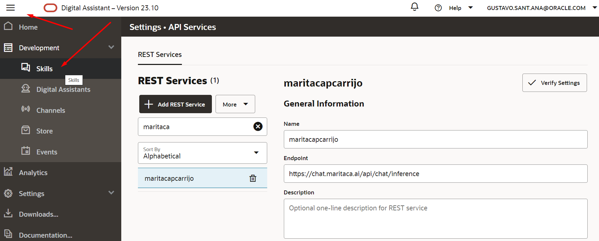

* Clique em New Skill

* Passe um nome, uma descrição, selecione a Primary Language para portugues e clique em CREATE

* Passe um nome, uma descrição, selecione a Primary Language para portugues e clique em CREATE

* Com a Skill criada você verá a tela de Intenções para iniciar seu fluxo de conversação. Clique em + intent

* No exemplo do Lab, você criará intenções para pedir pizza, cancelar um pedido e registrar uma reclamação. A intenção de pedir pizza é uma intenção regular, o que significa que ela é mapeada para um fluxo específico que provavelmente envolverá uma ou mais trocas entre o usuário e a habilidade. As intenções de cancelar pizza e registrar reclamação são intenções de resposta, o que significa que os usuários que expressarem essas intenções receberão uma resposta estática simples. 

* Edite o nome para "comprar pizza"

* Desça a pagina até Uterrances to ADD e clique em "advanced input mode"

* Cole o texto abaixo e clique em CREATE: 

Olá, gostaria de pedir uma pizza!
Gostaria de fazer um pedido!
Oi, quero fazer um pedido!
Vamos pedir uma pizza de queijo
Gostaria de uma pizza grande, por favor!
Estou com vontade de comer uma pizza
Gostaria de pedir uma pizza
Posso pedir uma pizza?
O que há no cardápio de hoje?
Eu quero pizza
Quero pedir pizza para o almoço
Vocês têm pizzas de massa grossa disponíveis?
Pedir pizza!

* Criar a intenção de cancelar pizza

* A próximas intenção não é uma intenção transacional como a Comprar Pizza. Em vez disso, ela é uma intenção de resposta: ela retorna uma única resposta em resposta à entrada do usuário resolvida. Embora você normalmente use intenções de resposta para perguntas frequentes, aqui vamos usá-las para Cancelar pizza para que possamos demonstrar uma habilidade multiintenção em ação sem primeiro ter que implementar fluxos para todas as intenções.

* Clique em Add Intent

* Edite o nome para "Cancelar pizza"
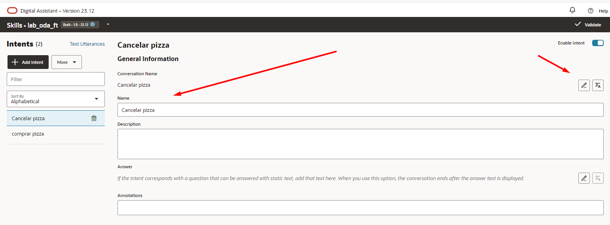

* Clique no lapis em Answer (resposta) e adicione o texto: "Sinto muito em ouvir isso, estou cancelando seu pedido!"

* Desça a pagina até Uterrances to ADD e clique em "advanced input mode"

* Cole o texto abaixo e clique em CREATE: 

Posso cancelar a minha entrega?
Cancelar a minha pizza
Cancele minha pizza por favor
Como posso cancelar a minha entrega?
Eu não quero mais minha pizza
Eu realmente não quero mais a pizza
Eu gostaria de cancelar o meu pedido, por favor
Foram mais de 20min. Por favor, cancele meu pedido e emita um reembolso para o meu cartão.
Preciso cancelar meu pedido
Por favor, cancele meu pedido de pizza
Por favor, não entregue minha pizza

* No topo da pagina, clique em Train e depois Submit, aguarde até o treino ser concluido. Pode demorar alguns minutos.
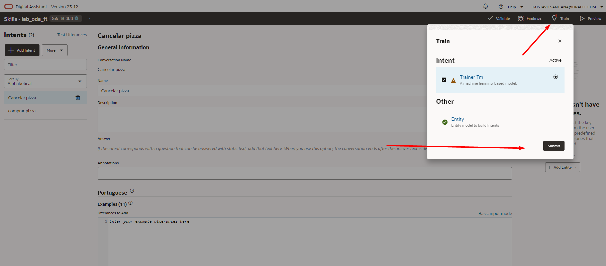

* Teste seu modelo

* Clique no link Test Utterances (Testar Declarações) que aparece na parte superior da página Intenções.

* No campo Idioma da caixa de diálogo, selecione Portugues.

* No campo Utterance, digite "Desejo pedir pizza". Em seguida, clique no botão Testar (localizado no canto inferior direito do testador) e observe os resultados do teste.

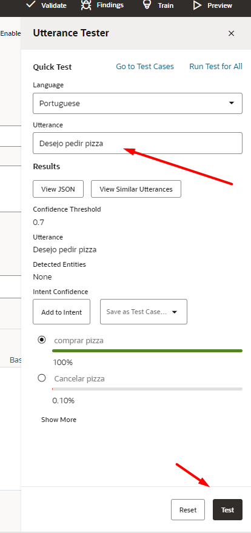

## Criar entidades
* Agora é hora de adicionar entidades, que detectam informações na entrada do usuário que podem ajudar a intenção de atender a uma solicitação do usuário.

* Criaremos entidades personalizadas para tamanho e sabor da pizza

* Na navegação à esquerda do designer, selecione o ícone Entidades.
* Clique em + Adicionar entidade para criar uma nova entidade.
No campo Nome, altere o valor para "TamanhoPizza"

* Na seção Configuração, selecione Lista de valores no menu Tipo.

Clique em + Valor.
Em Valor, digite pequena

Em Sinônimos, digite pequeno e clique em Enter. Digite mini, em seguida, clique em Enter novamente.

* Clique em Criar.

* Repita os passos para o tamanho medio e grande como mostra na imagem

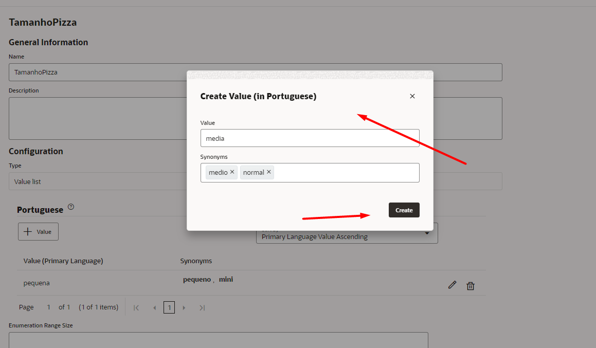
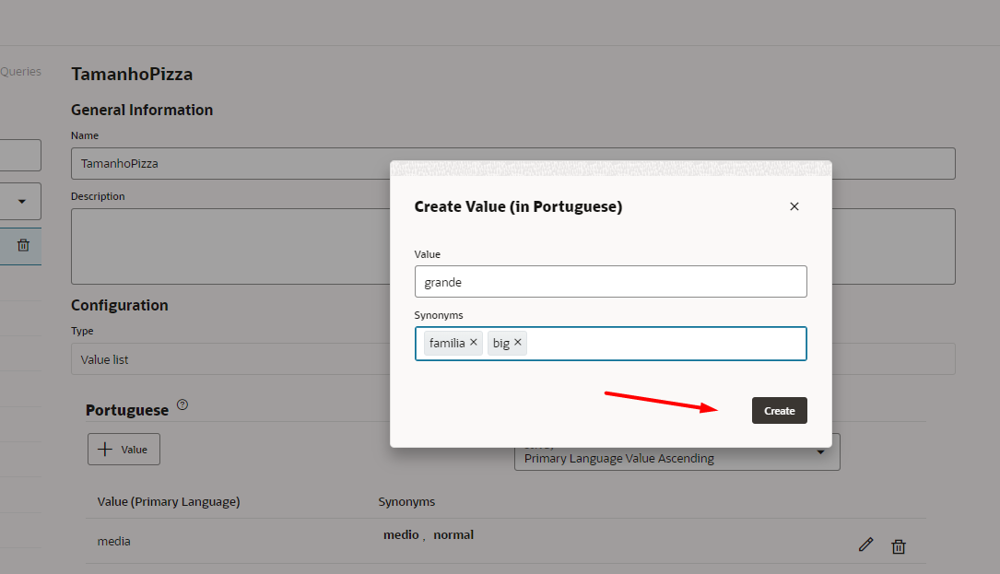

* Sua Entidade "TamanhoPizza" deve possuir estes valores:

* Repita os passos anteriores para criar uma nova entidade para os sabores de pizza:

* Editar prompts para as entidades

* Agora vamos inserir algum texto para solicitar que os usuários insiram valores que podem ser correspondidos por essas entidades.

* Na lista de entidades, selecione TamanhoPizza.

* Role para baixo até a seção Prompts.

* Na linha do prompt padrão ("Please enter TamanhoPizza?"), clique em Ícone Editar, substitua o texto por Qual tamanho você gostaria para sua pizza? Em seguida, clique em Enter.

* Faça o mesmo com SaborPizza passando a frase "Qual Sabor de pizza você gostaria?"

* Mais adiante no tutorial, você notará que a habilidade usará esses prompts quando precisar pedir ao usuário o tamanho da pizza e o sabor da pizza.

* Criar uma entidade "Composite bag" 

* Nesta etapa, você simplificará seus esforços de desenvolvimento usando uma entidade de bag, que permite gerenciar as três entidades que você acabou de criar como uma entidade consolidada. Quando essas entidades são controladas por uma bag, você não precisará criar referências separadas para elas no fluxo de diálogo. Além de unificar suas entidades, as várias propriedades da bag permitem que sua habilidade corresponda a valores de entidade em cenários complexos do mundo real que envolvam entrada do usuário.

* Clique em + Adicionar entidade.

* No campo Nome, insira bagPizza

* Na seção Configuração, selecione "Composite bag" no menu Tipo e clique em Criar.
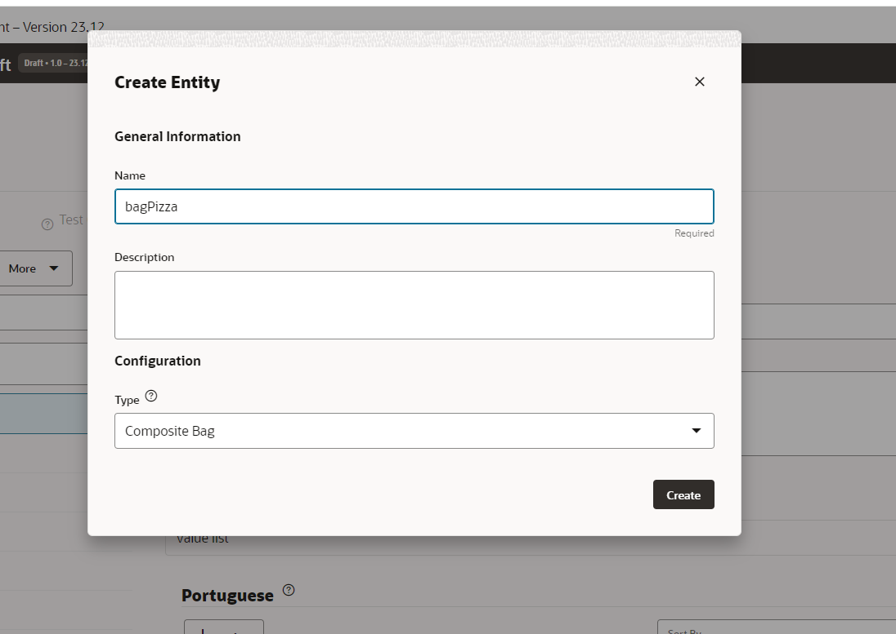

* Para adicionar as entidades que são gerenciadas pela bag, você precisa criar referências para elas chamadas itens. Clique em + Item.

* Na caixa de diálogo Adicionar Item, substitua BagItem1 no campo Nome por TamanhoPizza

* Selecione Entidade como o tipo. Escolha TamanhoPizza na lista Nome da entidade.

* Clique em Fechar

* Repita estas etapas para criar um item para a entidade SaborPizza

* Sua bag deve ter a seguinte aparência: 

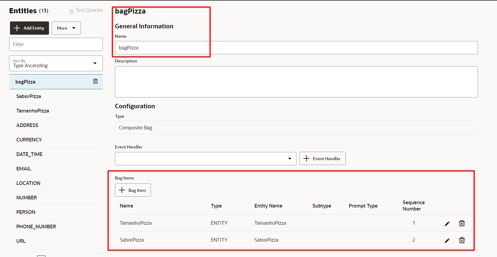

* Clique em Treinar.
* Selecione Entidade e clique em Enviar.

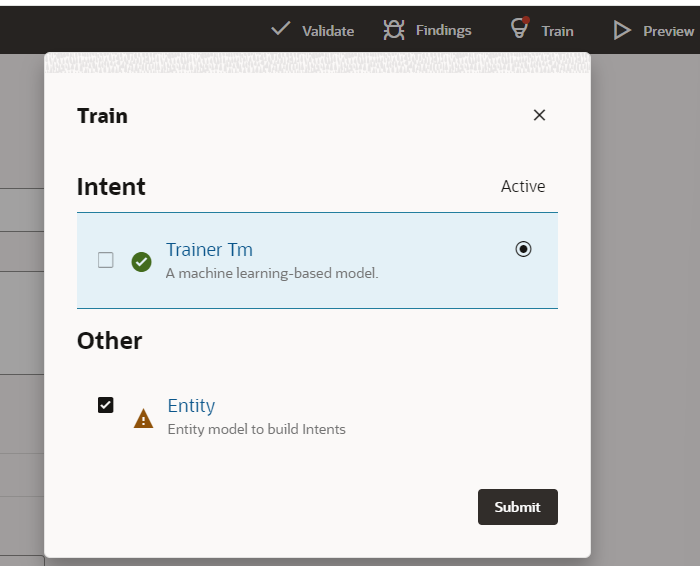

## Associe as entidades à intenção da OrderPizza

* Para que uma entidade seja reconhecida ao analisar a mensagem de entrada do usuário, ela precisa ser associada às intenções apropriadas. Nesse caso, precisamos associar a entidade de bag com a intenção Comprar Pizza.

* Na navegação à esquerda do designer, selecione o ícone Intenções.
* Selecione a intenção Comprar Pizza.
* Clique no menu suspenso Adicionar Entidade (no canto superior direito da página), digite no Campo de Filtro e selecione bagPizza

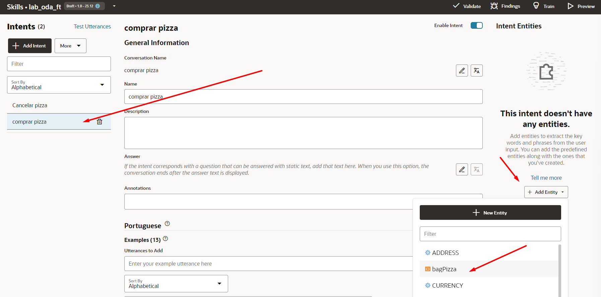

* Retreine o modelo com o Trainer Tm.

* Testar as entidades
* O recurso Utterance Tester permite testar se a habilidade identifica valores de entidade na entrada do usuário.

* Na navegação à esquerda do designer, selecione o ícone Intenções.

* Clique no link Test Utterances. Clique em Redefinir para limpar o campo de entrada.

* No campo Utterance da caixa de diálogo, digite "Desejo pedir uma pizza pequena de calabresa" e clique em Testar.

* Como as entidades são reconhecidas na entrada do usuário, a habilidade não precisa pedir ao usuário essas informações mais tarde no fluxo.

## Notas sobre o que você acabou de fazer

* Nesta parte do tutorial, você criou entidades personalizadas para a intenção Comprar Pizza, associou as entidades à intenção e testou o reconhecimento de entidade no testador de habilidades incorporado.

* Semelhante à intenção Comprar Pizza, você normalmente precisaria criar e associar entidades para as outras intenções também. No interesse do tempo, este tutorial se concentra apenas na intenção Comprar Pizza.

## Criar o fluxo de diálogo

* Com o modelo de PNL criado, você está pronto para criar um fluxo de diálogo para a habilidade. O fluxo de diálogo é um modelo para as interações que permitem a conversa entre a habilidade e o usuário. Embora você vá criar um único fluxo neste tutorial, uma habilidade pode ter vários fluxos que oferecem suporte a diferentes casos de uso e funções.

* Clique em Flow Dialog (Fluxos) na barra de navegação esquerda.

* Clique em Adicionar fluxo.

* Selecione a intenção Comprar Pizza e clique em criar

* No editor de fluxo de diálogo, passe o mouse sobre o nó Iniciar (Start) para exibir seu menu "...". Clique no menu e, em seguida, clique em Adicionar estado inicial.

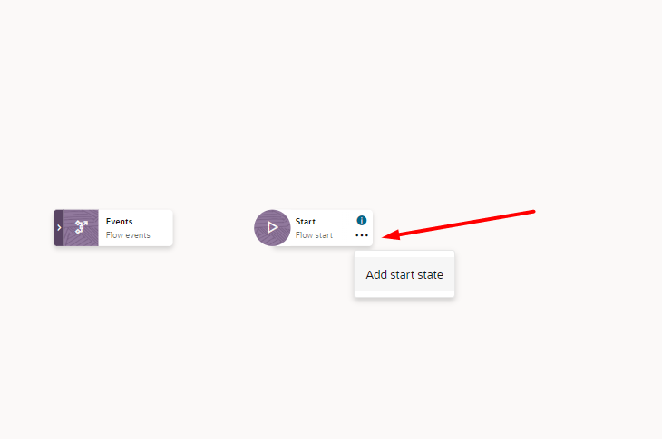

* Selecione Send Message, cliquem em inserir

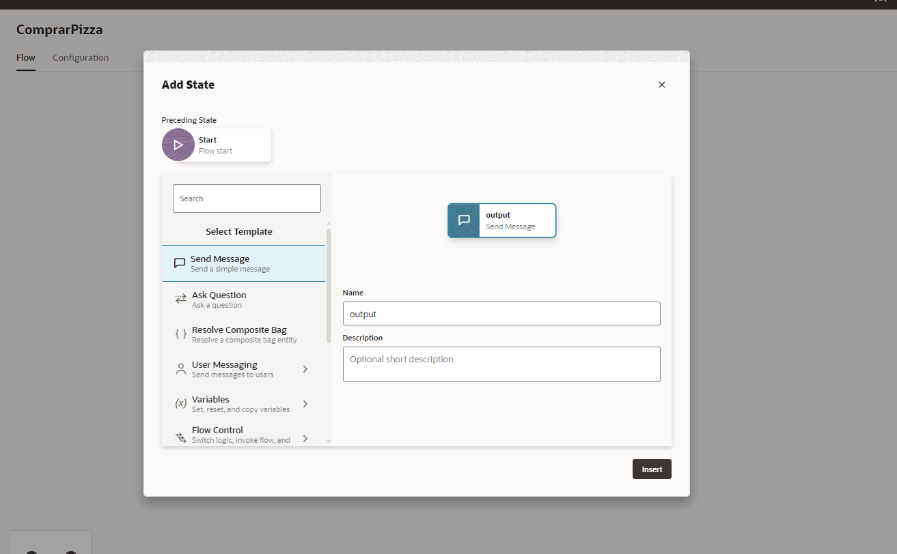

* Adicione o texto no campo de mensagem "Certo, vamos iniciar seu pedido!"

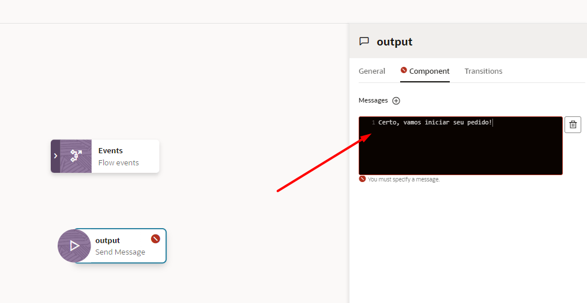

Clique em adicionar novamente e vá até a terceira opção "Resolve Composite Bag"

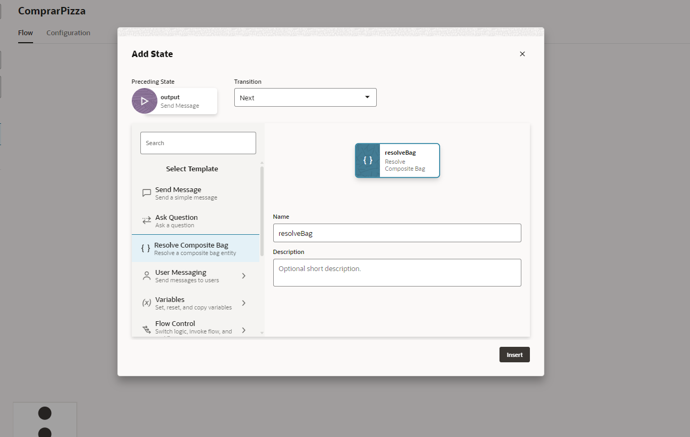

* Crie uma variavel para adicionar a bag como mostra a imagem
* Passe as informações a seguir

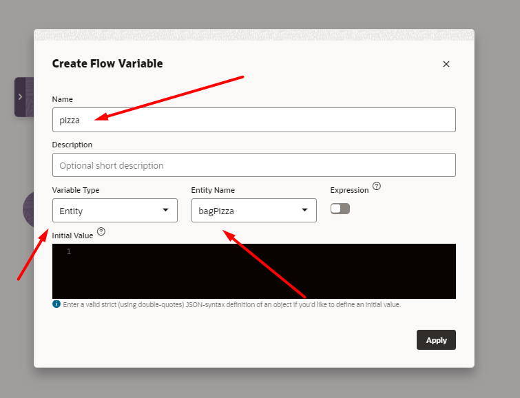

* Clique em ... e adicione outro estado.
* Selecione Send Message, cliquem em inserir

* Adicione o texto no campo de mensagem "Sua Pizza ${pizza.value.TamanhoPizza.value} de ${pizza.value.SaborPizza.value} será entregue o mais rapido possivel"

* Lembre-se os nomes dos campos da bag e variaveis devem ser exatamente como mostra no exemplo para não acarretar em erros.

* Quando terminar, o fluxo deve ter a seguinte aparência:

## Teste sua habilidade

* Clique em Preview e teste sua habilidade para comprar pizza e cancelar pedido
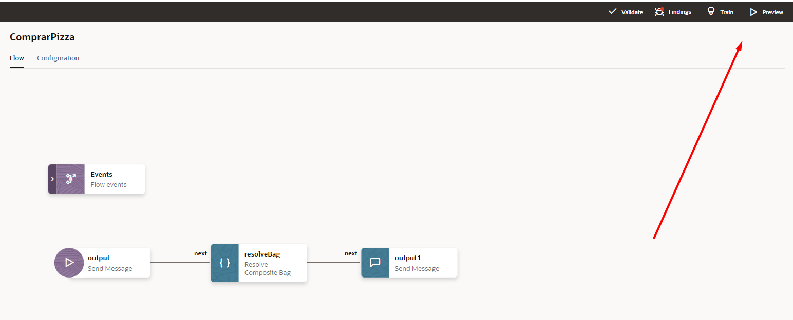

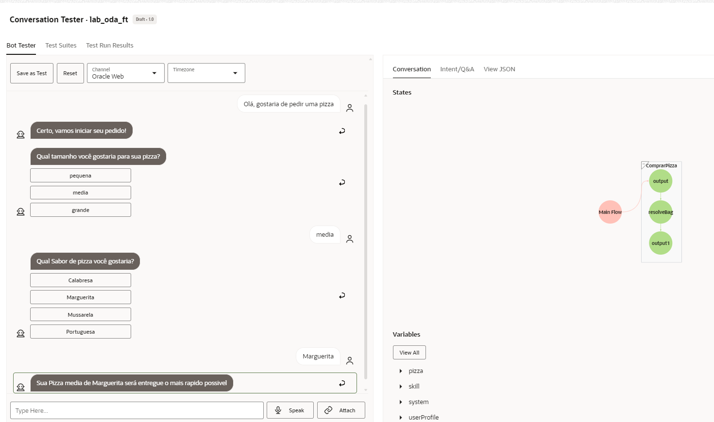

* Teste a intenção de cancelar

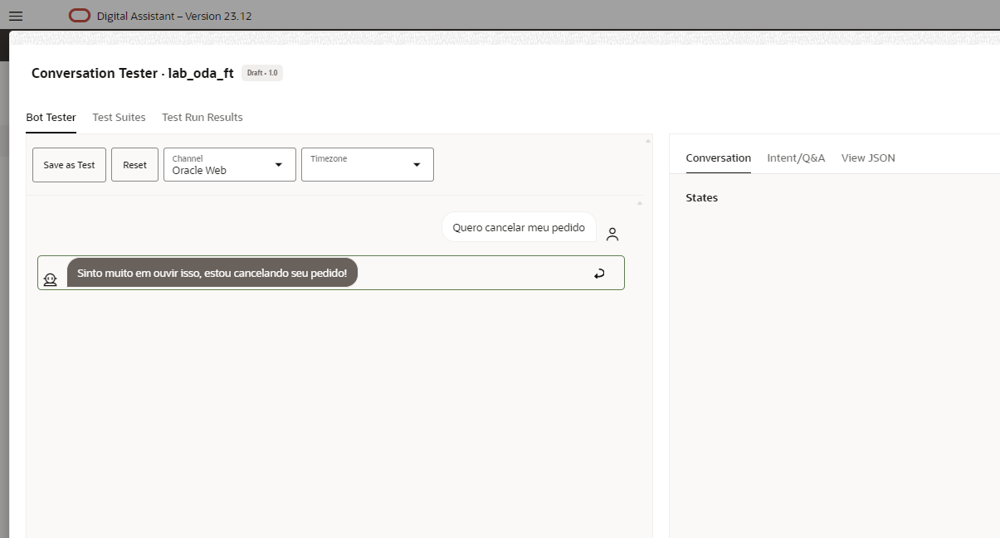

* Em UnresolvedIntent, clique no primeiro State e clique em "add precending state"

* Selecione Call Rest para fazer a chamada ao LLM

* No Bloco Call Rest selecione sua integração com o Maritaca LLM, Method POST e cole o texto abaixo em Request Body: 

{
    "messages": [
        {
            "role": "user",
            "content": "${system.message.messagePayload.text}"
        }
    ],
    "do_sample": true,
    "max_tokens": 200,
    "temperature": 0.7,
    "top_p": 0.95
}

* Em Result Variable, clique em Create e em Flow Scope Variable

* em Name coloque "saida_LLM" e clique em Apply

* Volte e em Headers no Bloco REST escreva "authorization" em KEY e cole sua chave API no Value como mostra na imagem abaixo: 

* Volte para o fluxo e em send Message mude o conteudo para o texto abaixo: 

${saida_LLM.value.responsePayload.answer}

* Volte para o fluxo e em Call_LLM clique nos ... e em Make Start State como mostra na imagem

* Clique em Preview, faça uma pergunta e veja sua integração com o LLM responder.
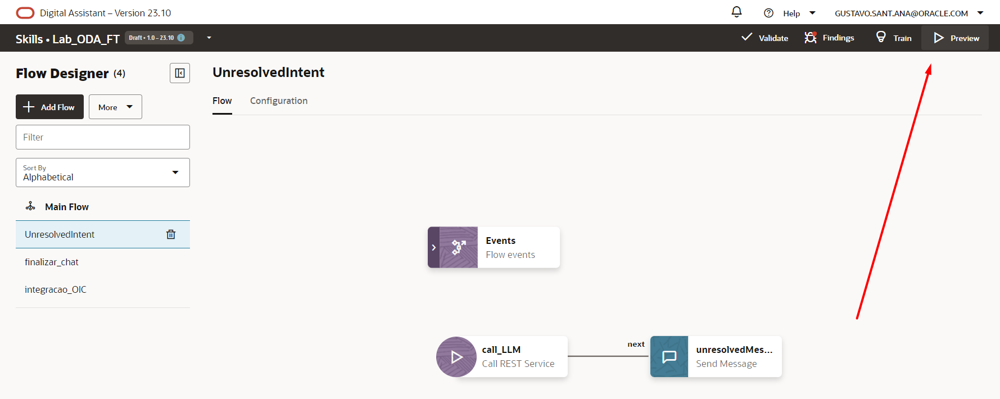
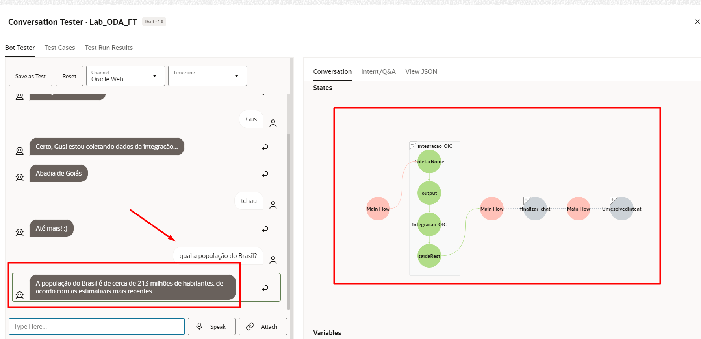

### Parabéns você finalizou seu Laboratório!!! 

## Autor

Gustavo Sant'ana

## Documentacões adicionais

* [ODA Documentation](https://docs.oracle.com/en/cloud/paas/digital-assistant/)

* [Maritaca AI Documentation](https://chat.maritaca.ai/)
