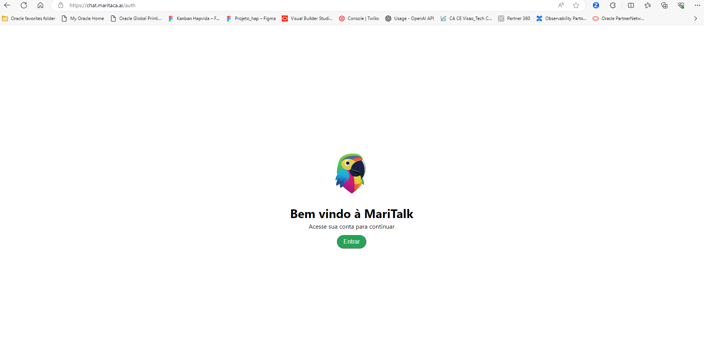
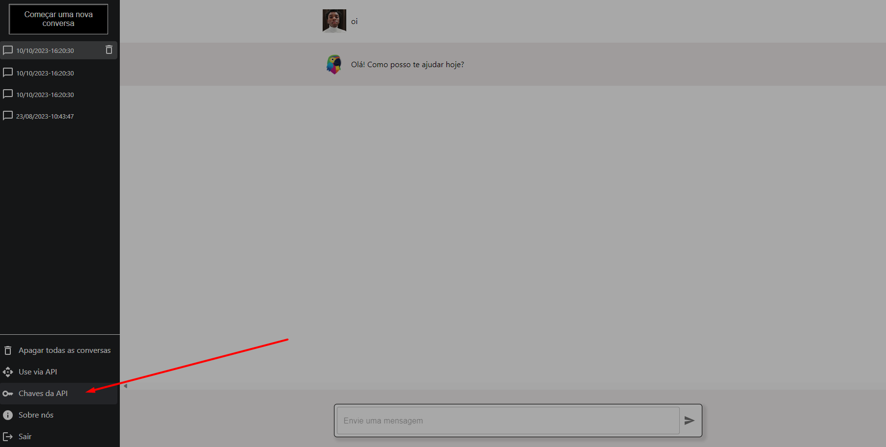

# Lab LLM - Workshop ODA, OIC, LLM

Criando chave de API para acesso ao Maritalk AI.

## Description

Neste laboratório vamos acessa a solução LLM Maritaca AI para pegar uma chave API e utilizar em nossos processos.

## Vamos nessa !

### 1. Acessar o link maritaca AI

* Abra o link https://chat.maritaca.ai/auth
* Clique no botão verde Entrar e crie uma conta ou faça login como mostra o site

* Ao acessar, clique em "Chaves de API no lado inferior como mostra na imagem e gere uma chave API

* Salve sua chave para utilizar no Lab de Oracle Digital Assistant

### Entre no LINK abaixo para seguir para a proxima etapa - Lab OIC
* [LAB OIC - Workshop ODA, OIC, LLM](https://github.com/Gusttavosant/Workshop_ODA_OIC_LLM/blob/main/ODA%20OIC%20LAB%20FAST%20TRACK/OIC%20LAB/HandsON.md)

## Documentacões adicionais

* [API-MARITALK](https://github.com/maritaca-ai/maritalk-api)
